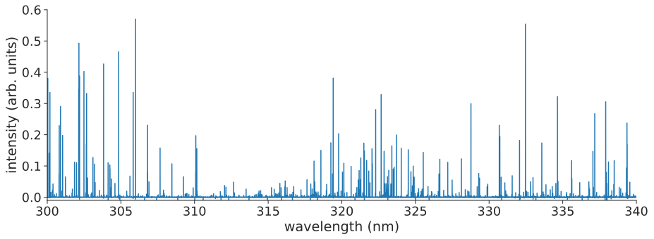

# 発表論文
**Simple Explanation for the Observed Power Law Distribution of Line Intensity in Complex Many-Electron Atoms**  
 **<u>Keisuke Fujii</u>**, Julian C. Berengut  
 *Physical Review Letters* **124,** 185002 (2020)  
<a href="https://doi.org/10.1103/physrevlett.124.185002">10.1103/physrevlett.124.185002</a>  

# 概要

価電子が複数ある原子をプラズマ中に導入すると、多数の線スペクトルが集まった森のような発光スペクトルが観測されることが知られています。
例えば、鉄原子には価電子が8個あります。鉄が含まれたプラズマからの発光スペクトルは以下のようなものです。

これまで、鉄ような多電子原子の発光スペクトルには、Learner則という統計法則が実験的に知られていました。
これは、ある発光強度 $$I$$ を持つ発光線の数 $$\rho(I)$$ がべき乗に従うというものです。
この法則は1982年にLearner氏によって発表されて以来、様々なグループらによって確認されていましたが、その由来は明らかになっていませんでした。

今回我々は、このLearner則に対して、初めて理論的な裏付けを与えました。
その理論は次節で簡単に紹介しますが、その結果として、発光線の数が以下の式で表されることを明らかにしました

$$
\begin{align}
\rho(I) \propto I^{-2 kT_e / \epsilon_0 - 1}
\end{align}
$$

ここで、 $$k$$ はボルツマン定数、 $$\epsilon_0$$ は原子に特有の定数、 $$T_e$$ はプラズマの電子温度です。
特に、べき指数が電子温度 $$T_e$$ に依存していることがわかります。

これまで、プラズマの温度を求めるためには、原子に関する様々なデータが必要でした。しかし一般に、正確な原子データを多電子原子に対して求めることは非常に難しいのが現状です。

一方で上記の結果を用いることで、正確な原子データが得られていなくても、多数の発光線スペクトルを観測してその統計分布を求めることでプラズマの電子温度を推定できることを示しています。

# 理論
提案した理論は、これまで知られている2つの統計的性質を組み合わせただけの非常に簡単なものです。
具体的には
1. 多電子原子の準位密度がエネルギーに関して指数関数的に振る舞う
2. 多電子原子の占有数密度は局所熱平衡に分布する

という性質です。

## 多電子原子の準位密度

準位密度 $$\rho_E(E)$$ は、ある励起エネルギー $$E$$ の付近に励起状態がいくつ分布しているか、という量です。
多電子原子や原子核のような多体フェルミ粒子系では、これが指数関数的に増加することが知られています

$$
\begin{align}
\rho_E(E) \propto \exp\left(\frac{E}{\epsilon_0}\right)
\end{align}
$$

ここで、$$\epsilon_0$$ は準位密度が増加する速度のようなものを表します。

## 占有数密度に対する局所熱平衡近似

ある原子を1つ考えた時、その原子がどの準位に存在するかという確率のことを占有密度数と呼びます。
熱平衡状態では、ある準位 $$i$$ の占有数密度がボルツマン分布

$$
n_i \propto \exp\left(-\frac{E_i}{k T_e}\right)
$$

で分布することが知られています。ここで、 $$E_i$$は準位$$i$$ のエネルギーを表します。

## べき乗則の導出

上記2つの性質を組み合わせます。
ある準位$$i$$からのエネルギー$\omega \sim \omega + d \omega$ を持つ発光線の数は、 $$\rho_E(E_i - \omega) d\omega$$ と書けるでしょう。
またそのような発光線の強度は、準位 $$i$$ の占有数密度 $$n_i$$ に比例するはずです。
つまり

$$
I \propto \exp\left(-\frac{E}{k T_e}\right)
$$

これらを組み合わせると、強度 $$I$$ を持つ発光線の数は

$$
\rho(I) dI \propto \int_\Omega d\omega \rho_E(E - \omega) \rho_E(E) dE \propto I^{-2kT_e / \epsilon_0 - 1} dI
$$

ここで $$\Omega$$ は観測波長範囲を表します。
これで、多電子原子の発光線の数がべき乗に従うことが示せました。

また、この式からはべき指数が $$2kT_e / \epsilon_0 - 1$$ というように電子温度と原子固有の定数 $$\epsilon_0$$ のみによって定まり、観測波長範囲 $$\Omega$$ にはよらないこともわかります。
このことは、Learnerによって報告されていた、発光線分布のエルゴード性も説明しています。
