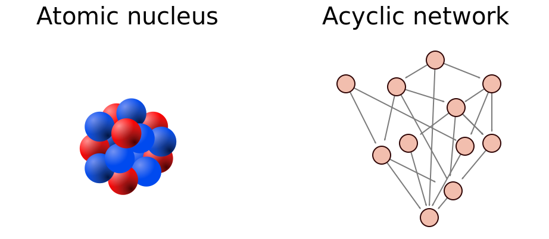
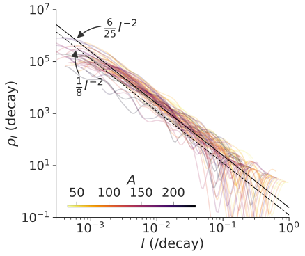

# 発表論文
**Power-Law Intensity Distribution of 
γ
-Decay Cascades: Nuclear Structure as a Scale-Free Random Network**  
 **<u>Keisuke Fujii</u>**, Julian C. Berengut  
 *Physical Review Letters* **126,** 102502 (2021)  
<a href="https://doi.org/10.1103/PhysRevLett.126.102502">10.1103/PhysRevLett.126.102502</a>  

# 概要

原子核は陽子と中性子が集まってできています。
原子核も原子と同じように、十分なエネルギーを与えると励起状態に遷移しますし、励起状態は光を放出して脱励起します。
ただし原子とはエネルギースケールが６桁異なるため、放出される光子はγ線となります。そのため、この脱励起現象はγ崩壊と呼ばれています。

これまで多電子原子については、発光線の数はその強度のべき乗に比例する、という法則（Learner則）が知られていました。
これは、我々がこれまでその理論的説明を与えたものです。
今回の研究では、同様の性質を原子核のγ崩壊に対して指摘しました。
ただしγ崩壊現象の場合、γ線の数 $$\rho(I)$$ は強度 $$I$$ に対してよりユニバーサルな関係

$$
\rho(I) dI = \frac{6}{25} I^{-2} dI
$$

に、原子核の種類や、その励起原子核がどのようにして作られたかによらず成り立つことがわかりました。

この例からもわかるように、多電子原子・原子核からの放射崩壊現象はべき分布と深い関係がありそうです。
では、その本質的な理由は何でしょうか。

一般にべき分布は、スケールフリー性を示す系からよく観察されます。
本研究ではさらに、多電子原子や原子核では、崩壊遷移のネットワーク構造がスケールフリー性を有していることを指摘しました。

# 詳細
## 非循環ネットワーク上でのランダムウォーク

ネットワークとは、ノード・エッジからなるシステムのことで、複雑な現象をモデル化するときによく使われます。その中でも、非循環ネットワークとは、エッジに向きが付いており、さらにエッジの向き通りにたどれば同じノードを通ることができないものを言います（ページ上の図を参照）。

このような非循環ネットワーク上のランダムウォークは、様々な自然現象・社会現象をモデル化するのに使われてきました。
例えば Corominas-Murtra らは、非循環ネットワーク上でのランダムウォークで自然言語中の単語の出現頻度がべき乗に従う理由を説明しようとしています（PNAS2015）。

ここで、このような非循環ネットワーク上のランダムウォークにおいて、各ノードを通る確率を求めてみましょう。
非循環ネットワークでは、各ノードに順序をつけることができることが特徴です。
下から数えて $$m$$ 番目のノードからは、 $$n > m$$ 番目のノードにはいけないけど $$n < m$$ 番目のノードには到達することができる、というようにこの順序で非循環性を表すことが出来ます。
ランダムウォークにおいて $$n$$ 番目のノードを通る確率 $$x_n$$ は、それより上のノード $$m$$ を通る確率と、 $$m$$ ノードから $$n$$ ノードにエッジがある確率 $$f_{n,m}$$ で以下のように表すことができるでしょう。

$$
\begin{align}
x_n 
&= \sum_m f_{n,m} x_n\\
&\approx \int_m^\infty f(n,m) x(m) dm
\end{align}
$$

ここで、式(2)ではノード数が十分に大きいとして近似しています。

もし分岐比にノード依存性がなければ、 $$f_{n,m} = 1 / m$$ と表すことができます。これはつまり、 $$m$$ 番目のノードにいるときには、次のステップではその下の全てのノードに等しい確率で遷移することを示します。
このとき $$x_n \propto n^{-1}$$ が求まります。
このように、分岐比 $$f_{n,m}$$ の依存性がランダムウォークの性質を決めています。

## スケールフリー非循環ネットワーク
さて、分岐比の分布としてスケールフリー性を有する、以下のようなものを考えましょう。

$$
\begin{align}
f(n,m) = \frac{1}{m} g\left(\frac{n}{m}\right)
\end{align}
$$

ここで $$g(x)$$ は任意の非負の整数で、 $$\int_0^1 g(t) dt = 1$$ を満たすものです。
このとき、 $$x(n) = \eta \, n^{-1}$$ が $$g$$ の形によらず示せます。
ただし、 $$1/\eta = -\int_0^1 \log t\; g(t) dt$$ という $$g$$ に依存する定数です。

このように、スケールフリー非循環ネットワーク上でのランダムウォークでは、滞在確率の分布がべき乗になることがわかります。

なお、たくさんあるノードのうち、滞在時間 $$x$$ を持つノードの数分布は

$$
\rho(x) = \eta\; x^{-2}
$$

と表せます。

また同様にして、それぞれのエッジを通る確率も考えることが出来ます。
エッジ $$n \leftarrow m$$ を通る確率は $$I_{n,m} = f_{n,m} x_m$$ です。
そのためエッジを通る確率が $$I$$ であるようなエッジの数は

$$
\rho(I) = \frac{\eta}{2}\; I^{-2}
$$

と表すことが出来ます。

## 放射崩壊カスケードとスケールフリーネットワーク

多電子原子や重元素核のような多体量子系は、どのようなネットワーク構造と見ることができるでしょうか。
放射崩壊では、励起状態の系が光を放出してエネルギーが下の準位に遷移します。
外からエネルギーを与えられない限り、次に上の準位に遷移することはありません。
そのため、非循環ネットワークにモデル化することができるでしょう。つまり、各励起準位がノードであり、各準位間の放射遷移がエッジに対応します。
準位間の遷移は、原子構造・原子核構造で決まる分岐比に従ってランダムに決定されるので、放射崩壊カスケードはこのランダム遷移の繰り返し、つまりランダムウォークとしてモデル化できるでしょう。

さて、ではそのランダムウォークの性質を決める、分岐比の分布はどのようになっているでしょうか。
詳細は省略しますが、原子核のエネルギー準位密度や、双極子遷移の性質などを考慮すると、分岐比は

$$
f(n,m) \propto \frac{1}{m} \left(1 - \frac{n}{m}\right)^3
$$

と書けることがわかります。
これは式(3) をみたしています。
ここから、エッジを通る確率の分布、つまり発光線強度 $$I$$ を持つような発光線の数分布は、 $$\frac{6}{25} I^{-2}$$ で表されることがわかります。

実際に、このような性質が成り立っているかどうか、原子核におけるγ崩壊カスケードの実験データを用いて確認しました。

その結果が上の図です。
これは、ENSDFという原子核データベースから、たくさんの核反応によるγ崩壊スペクトルデータを取得し、それらから作ったγ線強度の分布です。
たくさんの色の線が示してありますが、これらはそれぞれの核反応に対応しています。
線の色が、原子核の原子番号に対応しています。

上の議論で予想したとおり、どんな核反応をとってきてもγ線強度の数密度分布は単一の分布 $$\frac{6}{25} I^{-2}$$ に従うことがわかりました。
これは、原子核の構造がスケールフリー構造を実際に有していることを意味します。

## まとめ

本研究では、多電子原子や原子核などの多体量子系が、スケールフリー性を有していることを初めて指摘しました。
原子や原子核の研究は、100年以上歴史を持つものですが、上記性質はこれまで知られていなかったものです。
本研究は、Physical Review Letter誌に掲載されました。

