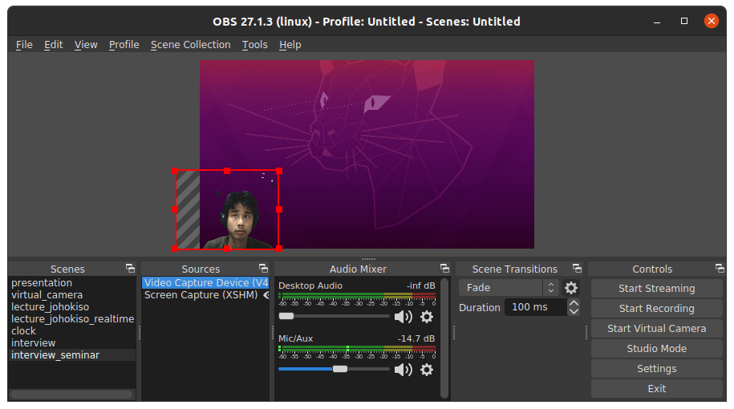

# ペンタブレットを使ったオンライン発表

最近はコロナ禍ということもあり、オンラインで発表する機会が増えてきました。
いろいろ工夫の余地がありますが、自分なりの方法が固まってきたので備忘録を兼ねてまとめておきます。

# 環境
## ハードウェア

発表に使っている機器は主に
+ ノートPC付属のカメラ
+ ヘッドセット （エレコム ELECOM HS-103TBK）
+ ペンタブレット （Wacom one）
+ クロマキー用の緑の布

です。
発表では特に音声が重要でしょう。
高いものでもよいのしょうが、私は激安の有線ヘッドセットを使っています。
録画して確認した結果、ヘッドセットのあるなしでは音声のクオリティは雲泥の差でした。

## ソフトウェア

私はLinuxを使っているので使えるソフトウェアには色々制限があるのですが、2021年現在、以下に落ち着いています。

- [Foxit pdf reader](https://www.foxit.com/pdf-reader/)
- [OBS studio](https://obsproject.com/)

# 概要
## 注意する点

オンラインならではの注意事項がいくつかあると思います。
- アニメーション・画面遷移エフェクトなどは、通信環境しだいで見にくくなる
- 現地での発表に比べて、小さい字も見やすい。16:9ディスプレイが標準
- 話者の表情がわかりにくい
- 意識してカメラを見ないとカメラ目線にならない
- ペンタブレットを使うと板書をすぐに共有できる

## 方針
これらをクリアするため、以下のようなフォーマットを使っています。

- 左下に私の顔（ライブ）
- ポインタの代わりに書き込み

授業でのアンケートによると、発表者の表情が映っていると聞きやすいそうです。
興奮度合いとかも表現できるので、そうかもしれません。
ただしそのためには資料を作るときに左下に無駄な余白を作る必要があります。

また、ポインタの代わりに書き込みを使うのは、とくに質疑応答のときに効果的です。簡単な手書きの図や式などもササッと書けます。
そのため、発表資料をPDFファイルにしてFoxit readerで開いています。
pdfへの書き込み機能を使いながら発表しています。

## 実装

これらを実装するために、OBS studioというソフトを使っています。
ただしOBS studioは、カメラ画像から顔だけを抽出する機能に優れていないので、実際に緑色の布を椅子の後ろに設置してクロマキーを使っています。

緑色の布は、Amazonで買いました（発表時に緑色の服を着てしまうとおかしくなります）。

### OBS Studioの設定
OBS studioは、動画配信などに使うソフトのようで、カメラキャプチャの画像やその背景などをうまく組み合わせることができます。

私は、上の図のような設定にしています。
クロマキーは、Sources > Video Capture Device を右クリックして Filtersから選ぶことができます。
クロマキーの性能はそんなによくないので、ライティングや設定を工夫する必要があります。

スクリーンキャプチャとして、ペンタブレットを選びます。
そのままだとメニューバーとかが映り込んでしまうので、配信したい場所だけが画面内に来るように調整します。

最後に、画面上で右クリックして出てくる `Full screen projector (preview)` から、生成画像を画面いっぱいに写して、Zoom や Teams などでその画面を共有すれば完成です。

ペンタブレット・ノートパソコンを含めて画面が３枚あるとやりやすいですが、なくても大丈夫だと思います。

# まとめ

mmhmm などを使うと同じように話者の顔を画面に表示できるようですが、フレキシビリティを考えるとOBSが良いと思います。その代わり設定が少し面倒です。

ジェスチャーもたまにしたり、表情に変化をつけて発表したりしているつもりですが、どれくらい良いかは実際よくわからないのでほぼ自己満足です。
それよりも発表内容を工夫する方が重要だと思います。
