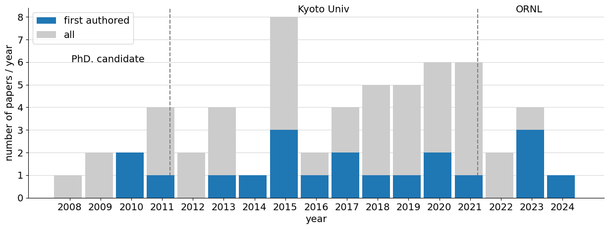
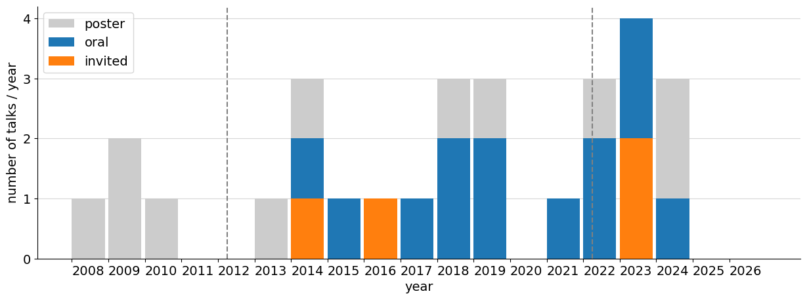
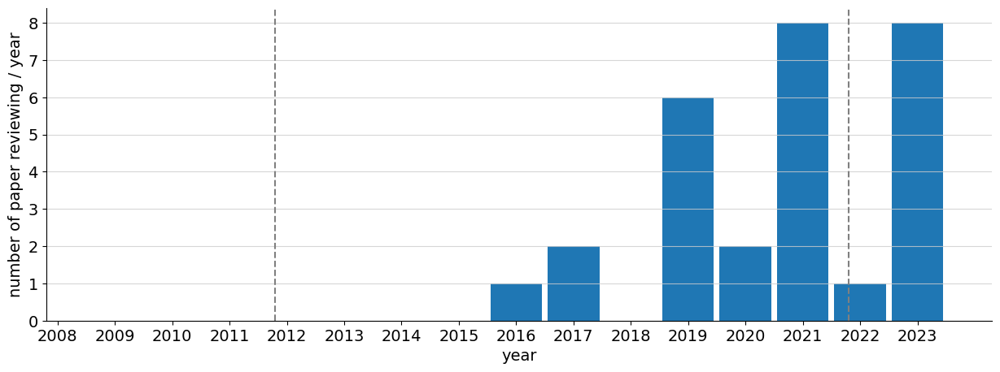

# About Me

## Current position
Senior R&D Staff Scientist at  
Fusion Energy Division, Oak Ridge National Laboratory, US

PhD of engineering (Kyoto university)  
博士（工学）

## Research summary
Working on atomic physics, plasma physics, and statistical physics.

原子物理・プラズマ物理・統計物理

## Other activities
### International program committee
- IAEA Technical Meeting on Fusion Data Processing, Validation and Analysis
### Open source contribution
#### As a contributor
- [xarray](https://docs.xarray.dev/en/stable/) Xarray makes working with labelled multi-dimensional arrays in Python simple, efficient, and fun!

#### As the main developer
- [py3nj](py3nj.readthedocs.io) Wigner's 3J, 6J, 9J symbols for python
- [lhdpy](https://github.com/fujiisoup/lhdpy) A small library to download LHD diagnostic data from LHD data archive
- [sif_parser](https://github.com/fujiisoup/sif_parser) A small package to read Andor Technology Multi-Channel files

## Research Activity
## Publication history

## Talk history

## Reviewing history

